<div align="center">

# Drans Trade

**A modern trading terminal — live watchlists, order placement, positions, holdings and instrument analysis in one responsive application.**

Built with Next.js 15 · TypeScript · Tailwind CSS · Playwright


</div>

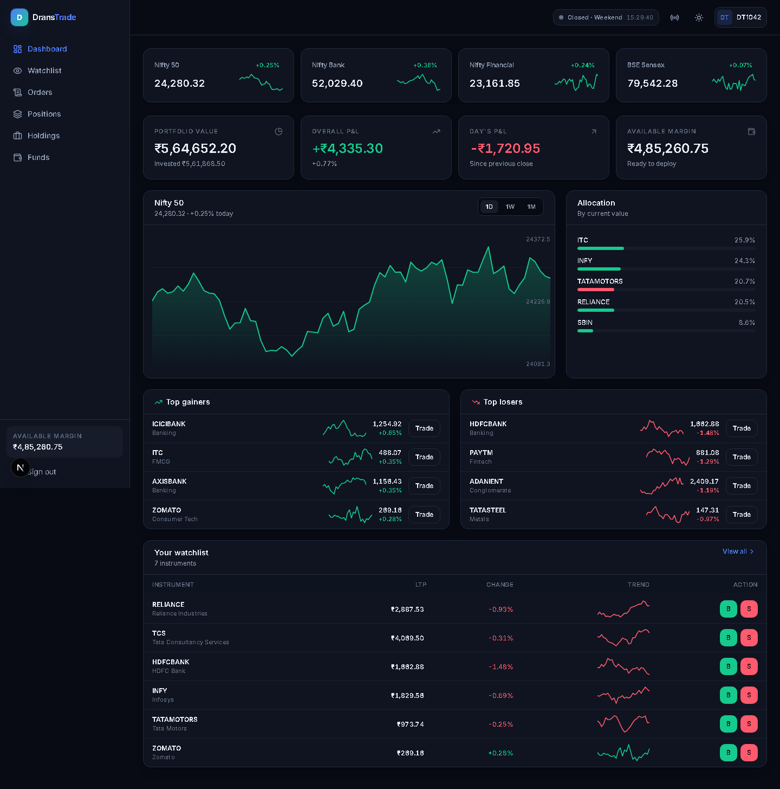

> Original work. Market data is simulated in-browser — no external API, no keys, no orders are placed.

---

## Table of contents

- [Overview](#overview)
- [Screenshots](#screenshots)
- [Functional modules](#functional-modules)
- [Tech stack](#tech-stack)
- [Frontend engineering highlights](#frontend-engineering-highlights)
- [Design system](#design-system)
- [Responsive strategy](#responsive-strategy)
- [Project structure](#project-structure)
- [Testing](#testing)
- [Getting started](#getting-started)
- [Engineering decisions](#engineering-decisions)

---

## Overview

Drans Trade is a full trading front end: a user signs in through a three-step flow, watches instruments update in real time, places market and limit orders against a live margin check, and tracks positions and P&L as prices move.

It is a **frontend showcase** — every chart, the design system, the state layer and the market simulation are written from scratch. Five runtime dependencies in total.

| | |
|---|---|
| **Routes** | 8 |
| **Runtime dependencies** | 5 |
| **First Load JS** | ~110 kB |
| **Charting libraries** | 0 — all SVG, hand-written |
| **Responsive coverage** | 28/28 route × viewport combinations verified |

---

## Screenshots

### Sign-in — three-step authentication

| Desktop | Mobile |
|---|---|
| 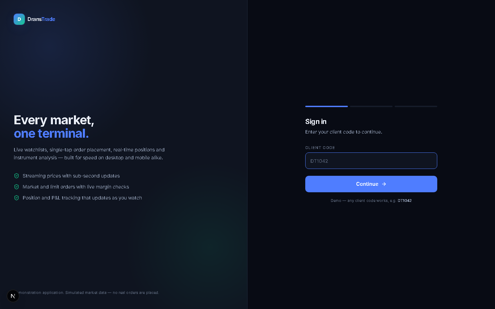 | 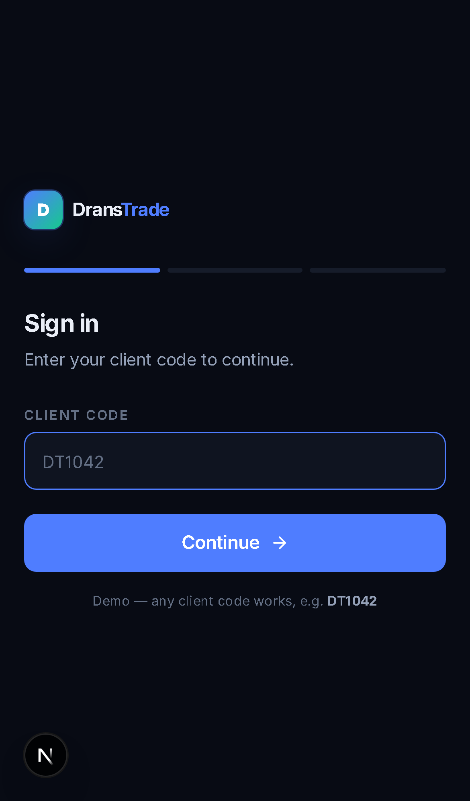 |

### Dashboard

| Desktop | Mobile |
|---|---|
|  | 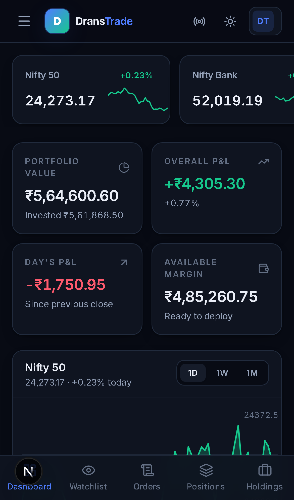 |

### Watchlist — live prices, search, inline trading

| Desktop table | Mobile cards |
|---|---|
| 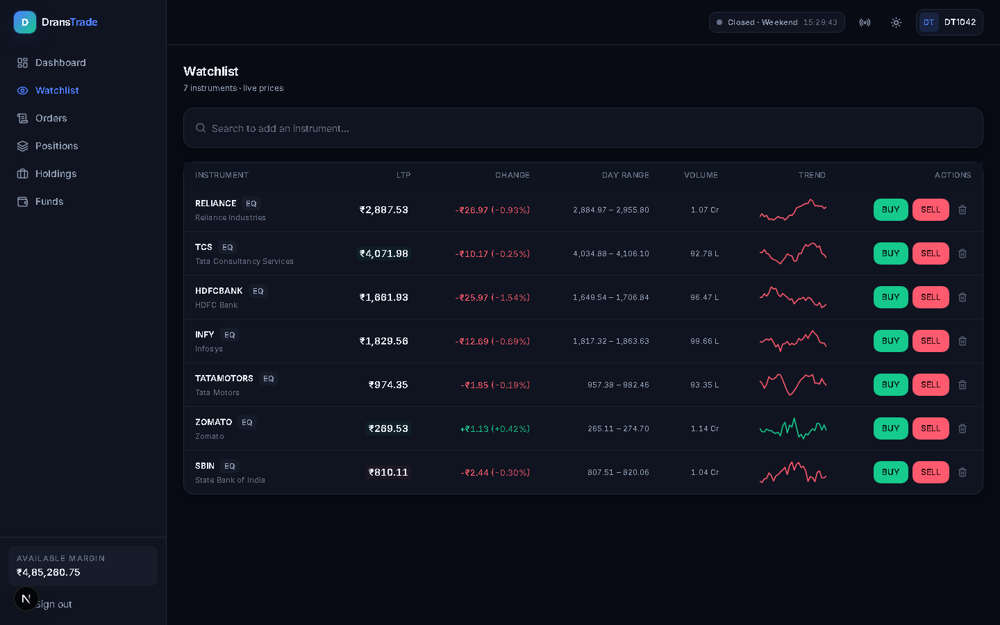 | 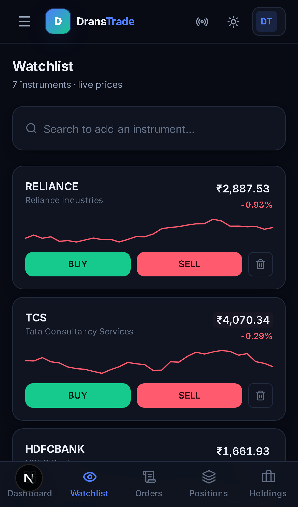 |

### Order ticket — drawer on desktop, bottom sheet on mobile

| Desktop drawer | Mobile sheet |
|---|---|
| 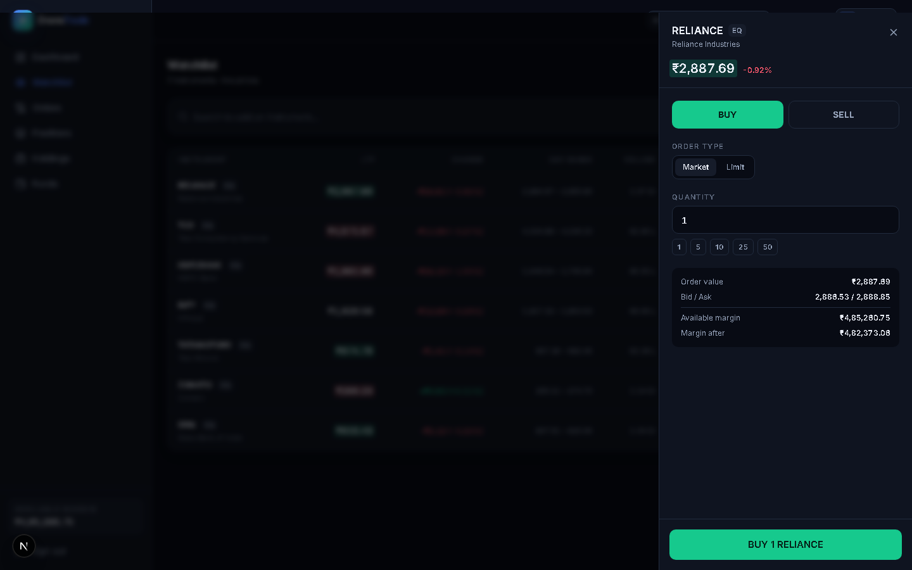 | 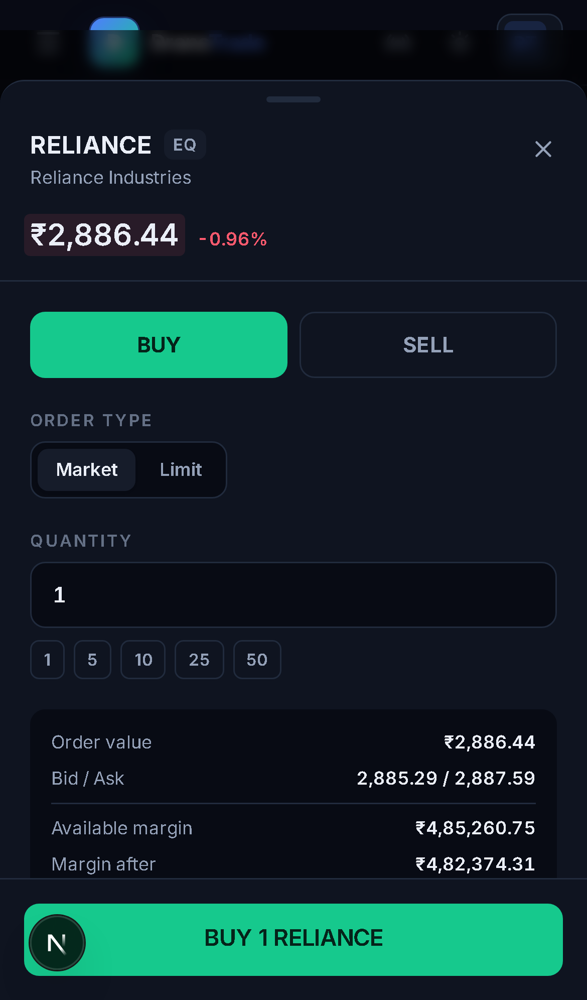 |

### Instrument page — charts, market depth, your position

| Desktop | Mobile |
|---|---|
| 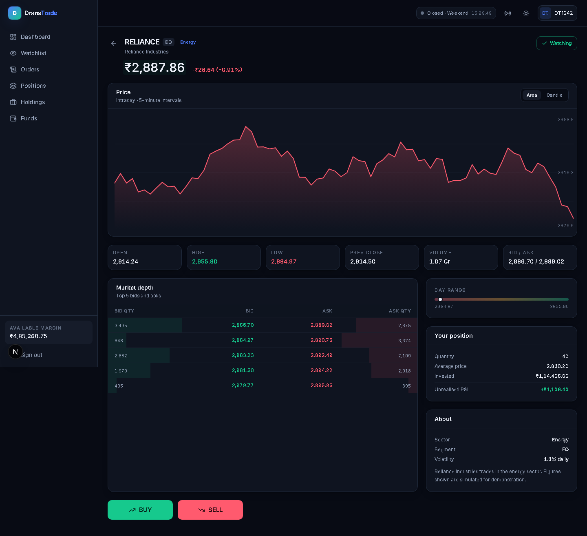 | 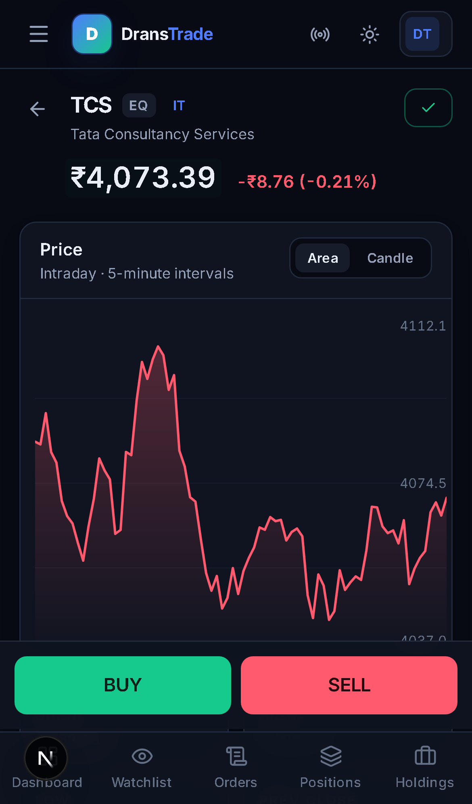 |

### Orders, positions and funds

| Order book | Positions | Funds |
|---|---|---|
| 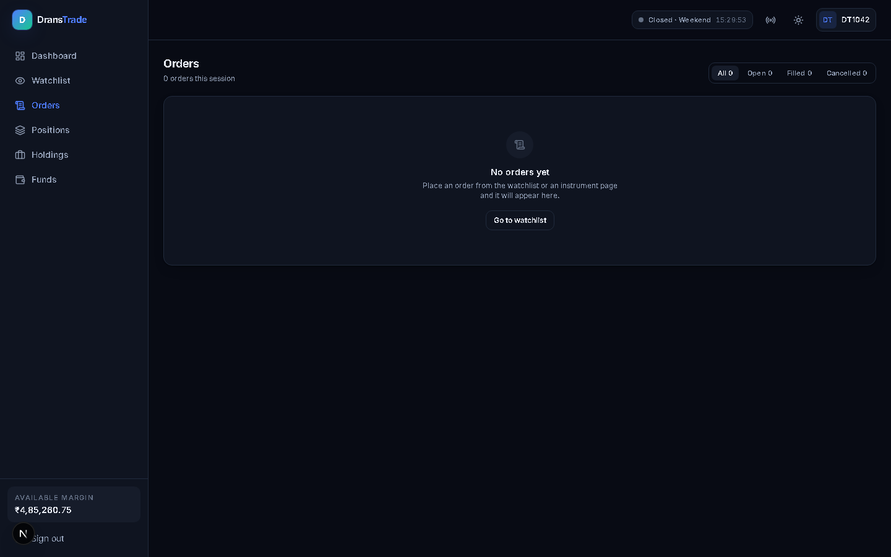 | 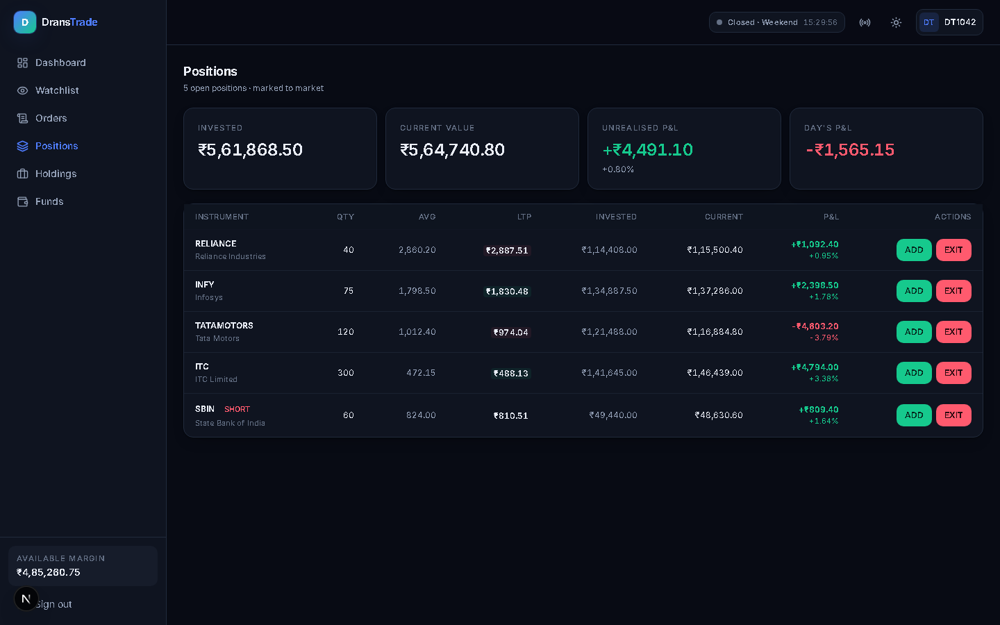 | 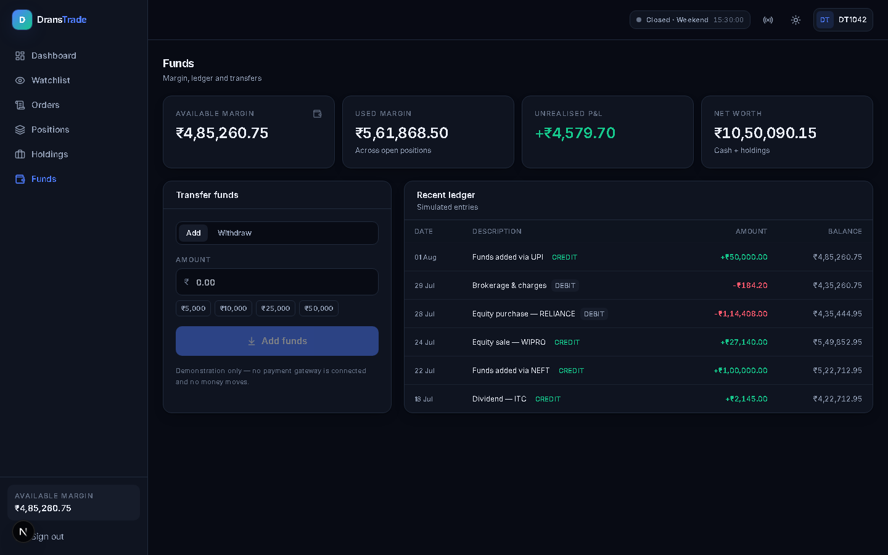 |

### Light theme

Themes are driven entirely by CSS custom properties — no component knows which theme is active.

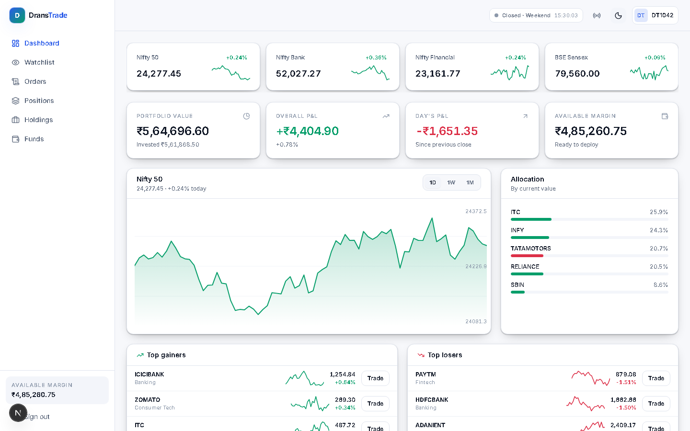

---

## Functional modules

### 1 · Authentication — `app/login`

A three-step flow modelled on how brokerage logins actually work: identity, a one-time factor, then a fast re-entry PIN.

- **Segmented code inputs** with auto-advance between boxes, **paste support** for a full code, and **backspace-to-previous**
- Auto-submits when the last digit is entered — no redundant confirm button
- Progress indicator across the three steps; back navigation preserves earlier input
- `inputMode="numeric"` and `type="tel"` so mobile shows the numeric keypad without spinner arrows
- Demo credentials: any client code, OTP `481902`, PIN `2468`

### 2 · Dashboard — `app/(app)/dashboard`

Information ordered by what a trader checks first: portfolio health → market → allocation → what to act on.

- Horizontally scrollable **index strip** (Nifty 50, Bank Nifty, Fin Nifty, Sensex) with inline sparklines
- Four portfolio stat cards — value, overall P&L, day's P&L, available margin
- **Interactive area chart** with 1D / 1W / 1M range switching
- **Allocation bars** coloured by per-holding P&L
- **Top gainers / losers** computed live from the streaming quote map
- Watchlist preview with inline buy/sell

### 3 · Watchlist — `app/(app)/watchlist`

- Live LTP, change, day range, volume and trend sparkline per instrument
- **Type-ahead search** across the instrument universe, excluding already-watched symbols
- Add/remove with immediate optimistic update
- **Table above `sm`, stacked cards below** — not a horizontally scrolling table

### 4 · Order ticket — `components/order/OrderTicket.tsx`

The most interaction-dense component in the app.

- **Market** and **limit** order types
- Live **order value** and **margin-after** recalculated as you type
- **Insufficient-margin guard** disables submission rather than failing after the fact
- Quick-quantity chips (1 / 5 / 10 / 25 / 50)
- Confirm button **restates the side and symbol** — `BUY 10 RELIANCE` — because the action is irreversible
- Limit orders **rest and fill automatically** when the simulated market trades through the price
- Escape to close; focus-visible outlines throughout

### 5 · Order book — `app/(app)/orders`

- Filter by All / Open / Filled / Cancelled with live counts
- Cancel resting orders
- Full audit trail retained for the session

### 6 · Positions & holdings — `app/(app)/positions`, `app/(app)/holdings`

- Marked to market on every tick
- Handles **short positions** (negative quantity) with correct P&L direction
- Weighted-average cost updates correctly when adding to a position, and is preserved when reducing
- Shared table component, different framing per page

### 7 · Instrument detail — `app/(app)/stock/[symbol]`

- **Area and candlestick** charts, toggleable
- Six key statistics — open, high, low, previous close, volume, bid/ask
- **Market depth** ladder with proportional bid/ask volume bars
- **Day range** indicator showing where the last price sits between low and high
- Your position in that instrument, if any
- Watch/unwatch toggle
- On mobile, buy/sell become a **fixed action bar** above the tab bar

### 8 · Funds — `app/(app)/funds`

- Margin summary — available, used, unrealised P&L, net worth
- Add/withdraw form with validation and confirmation states
- Transaction ledger

---

## Tech stack

### Core

| Technology | Version | Why |
|---|---|---|
| **Next.js** | 15 (App Router) | File-based routing, RSC boundaries, built-in font optimisation |
| **React** | 19 | Hooks, context, concurrent rendering |
| **TypeScript** | 5.7, `strict` | Full type coverage across state, market data and components |
| **Tailwind CSS** | 3.4 | Utility-first styling with a custom token layer |
| **lucide-react** | — | Consistent, tree-shakeable icon set |
| **clsx** | — | Conditional class composition |

### Tooling

| Tool | Use |
|---|---|
| **Playwright** | Route auditing, responsive verification, screenshot capture |
| **next/font** | Self-hosted Inter, no external font request |
| **PostCSS + Autoprefixer** | Tailwind pipeline |

### Deliberately *not* used

| Not used | Reason |
|---|---|
| Chart.js / Recharts / D3 | All four chart types are hand-written SVG — smaller and fully controllable at mobile widths |
| Redux / Zustand / Jotai | State shape is small and bounded; Context + `useReducer` is sufficient and keeps dependencies honest |
| Component libraries | The design system is part of what this project demonstrates |
| External market APIs | Keys, rate limits and market hours all break a demo; the simulation is deterministic and offline |

---

## Frontend engineering highlights

**Tabular numerals on every numeric cell.** `font-variant-numeric: tabular-nums` is applied via a `.tnum` utility. Without it, digit width changes as prices tick and entire columns jitter — the single most noticeable flaw in a financial UI.

**Flash-on-tick price cells.** `LivePrice` compares against the previous value held in a ref and bumps a React `key` to restart the CSS animation. Toggling a class instead would miss rapid successive ticks, because the animation never gets a chance to reset.

**Four hand-written SVG charts.** Sparkline, area, candlestick and a range indicator, each using `viewBox` with `preserveAspectRatio="none"` so they stretch to their container — responsive with no JavaScript measurement and no resize observers.

**Two navigation models, not one stretched.** Persistent sidebar above `lg`; fixed bottom tab bar below it, with `env(safe-area-inset-bottom)` so it clears the iOS home indicator.

**Hydration-safe by construction.** The live clock renders `null` until mounted, quotes seed from a deterministic snapshot so server and client agree on first paint, and all number formatting is locale-pinned to `en-IN` rather than relying on the browser default.

**Session survives reload.** State persists to `sessionStorage` and rehydrates on mount behind a `hydrated` flag, so the route guard can never redirect before the session has been read.

**Accessibility.** Semantic landmarks, `aria-label` on every icon-only control, `role="dialog"` + `aria-modal` on the order ticket, Escape-to-close, visible `:focus-visible` outlines, `role="alert"` on validation errors, and a full `prefers-reduced-motion` block. Zoom is deliberately left enabled.

---

## Design system

All colour lives in CSS custom properties as raw RGB channels, so Tailwind opacity modifiers still work (`bg-surface/60`) and a theme swap touches no component.

```css
:root {                        .light {
  --canvas:  8 11 20;            --canvas:  247 248 251;
  --surface: 15 20 32;           --surface: 255 255 255;
  --raised:  22 28 42;           --raised:  243 245 250;
  --ink:     234 238 247;        --ink:     17 24 39;
  --brand:   79 125 255;         --brand:   43 92 233;
  --up:      22 201 141;         --up:      6 158 106;
  --down:    255 90 110;         --down:    220 48 72;
}
```

Surfaces are layered back-to-front — `canvas` → `surface` → `raised` — so depth is expressed by elevation rather than borders alone. `up` and `down` are semantic and never used decoratively.

Primitives in `components/ui/Primitives.tsx`: `Card`, `CardHeader`, `Button` (6 variants × 3 sizes), `Badge`, `Stat`, `Segmented`, `EmptyState`, `Skeleton`.

---

## Responsive strategy

| Breakpoint | Navigation | Data display |
|---|---|---|
| `< 640px` | Bottom tab bar + drawer | Stacked cards |
| `640–1024px` | Bottom tab bar + drawer | Tables with contained scroll |
| `≥ 1024px` | Persistent sidebar | Full tables, multi-column grids |

Verified at **360 / 390 / 820 / 1440 px**.

---

## Project structure

```
app/
  layout.tsx                 root layout, font, store provider
  login/page.tsx             three-step authentication
  (app)/
    layout.tsx               authenticated shell wrapper
    dashboard/page.tsx
    watchlist/page.tsx
    orders/page.tsx
    positions/page.tsx
    holdings/page.tsx
    funds/page.tsx
    stock/[symbol]/page.tsx  instrument detail
components/
  shell/AppShell.tsx         sidebar, top bar, mobile tab bar, theme toggle
  ui/Primitives.tsx          design-system components
  ui/Charts.tsx              Sparkline, AreaChart, CandleChart, RangeBar
  market/LivePrice.tsx       flash-on-tick price cells
  order/OrderTicket.tsx      drawer / bottom sheet
  portfolio/HoldingsTable.tsx shared positions + holdings table
lib/
  market.ts                  instrument universe, seeded tick engine
  store.tsx                  reducer, context, derived selectors
  format.ts                  locale-pinned formatters
tests/
  audit.mjs                  responsive + console-error audit
  docshots.mjs               screenshot capture
```

---

## Testing

`tests/audit.mjs` signs in, visits every route at four viewport widths, and asserts:

1. **The URL actually landed on the target route** — catching silent redirects
2. **Zero horizontal overflow** on `documentElement`
3. **Zero console errors and page errors**

It also reports the widest element per page, which is how a real layout bug was located during development.

```
28/28 route × viewport combinations passing
```

```bash
node tests/audit.mjs
```

---

## Getting started

```bash
git clone https://github.com/AjuRram/drans-trade.git
cd drans-trade
npm install
npm run dev          # http://localhost:3100
```

Sign in with **any client code**, then OTP **`481902`**, PIN **`2468`**.

```bash
npm run build        # production build
node tests/audit.mjs # responsive audit
```

---

## Engineering decisions

<details>
<summary><b>Why simulated market data?</b></summary>

Public market APIs need keys, rate-limit aggressively, return nothing outside market hours and break demos at the worst moment. The engine produces price action from a seeded random walk — geometric Brownian motion with mild mean reversion — so the app behaves identically on every machine and never depends on the network. Each instrument carries its own volatility, so a bank stock moves differently from a small-cap.

Because the series is deterministic per symbol, the chart on the dashboard and the chart on the instrument page always agree.
</details>

<details>
<summary><b>Why Context + useReducer instead of a state library?</b></summary>

The state shape is small and well-bounded: session, watchlist, orders, positions, funds. A reducer expresses the transitions clearly — `applyFill` handles weighted-average cost, position reversal and short positions in one place — and derived data comes from a `usePortfolio` selector memoised on positions and quotes.

Adding a state library here would be a dependency in search of a problem.
</details>

<details>
<summary><b>The tick engine is shaped like a WebSocket handler</b></summary>

Quotes update via an interval that maps over the instrument list and replaces a quote map. That is deliberately the same shape a `socket.onmessage` handler would take, so replacing the simulation with a real feed is a single-function change rather than a refactor.

A rotating subset updates each cycle, because a real feed does not tick every instrument on every frame.
</details>

<details>
<summary><b>A real bug this project found</b></summary>

The first Playwright audit reported every route as passing. It was wrong — every route was silently redirecting to `/login`, because state lived only in memory and any full page load logged the user out. The audit passed because the login page also has no overflow and no console errors.

Two fixes followed: the audit now asserts the final URL, and session state persists to `sessionStorage` behind a `hydrated` flag.

The corrected audit then surfaced a genuine layout bug — 138 px of horizontal overflow on the funds page at 360 px. The cause was grid children defaulting to `min-width: auto`, so a `min-w-[480px]` table inside `overflow-x-auto` expanded its column instead of scrolling. Fixed with `min-w-0` on the grid children.
</details>

---

<div align="center">

Built by **[Arjun Ramachandran](https://github.com/AjuRram)** · [LinkedIn](https://www.linkedin.com/in/arjun-ramachandran-187a97185/)

</div>
